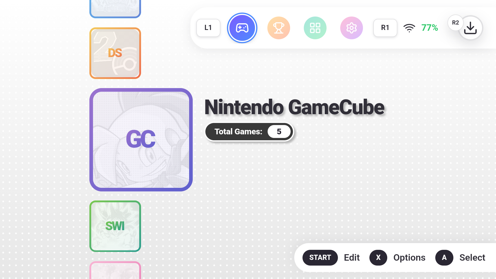
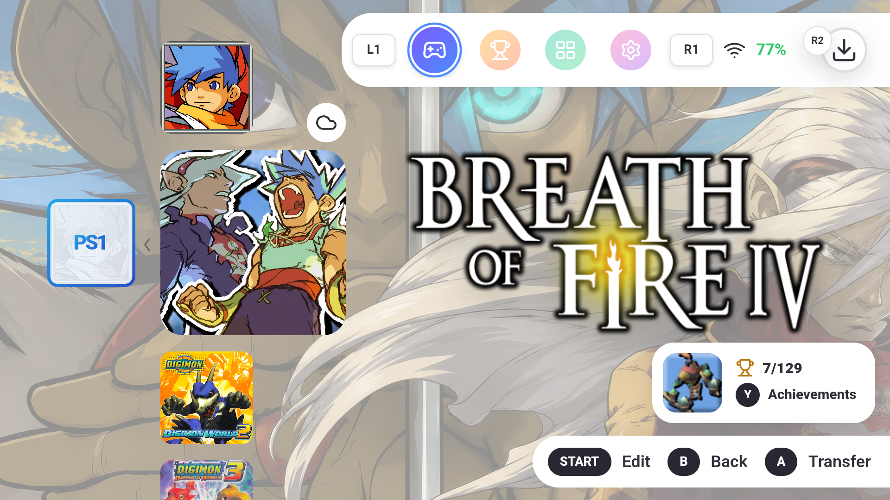
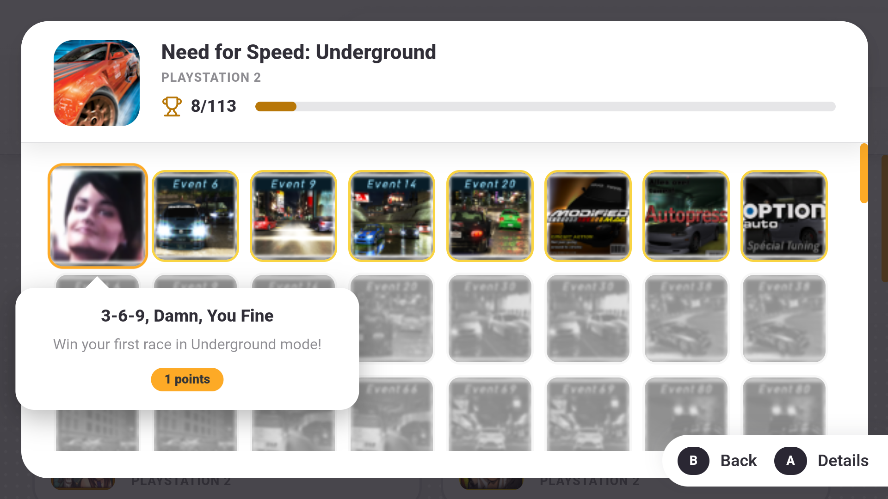
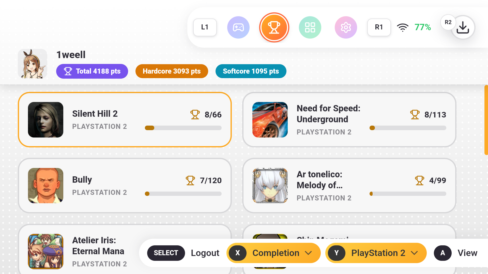
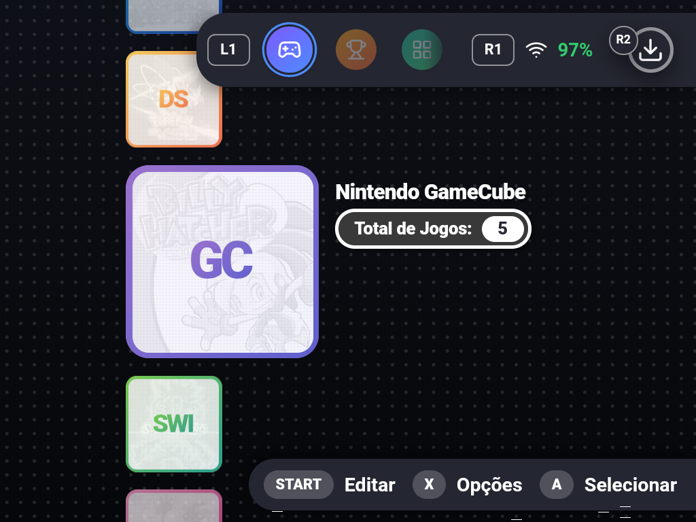
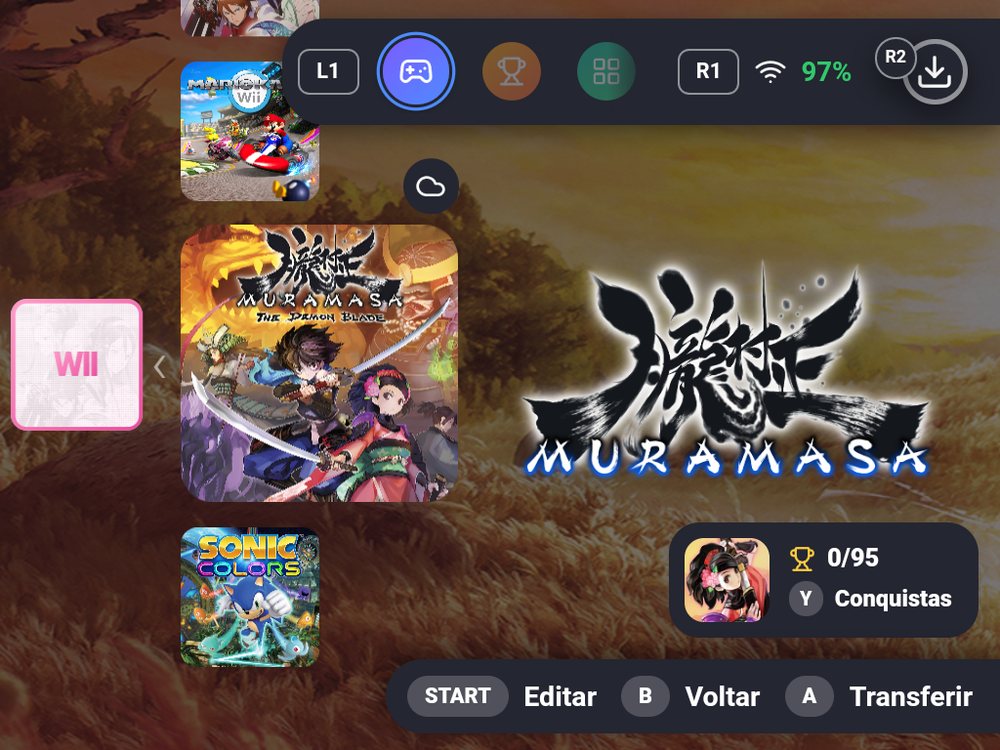
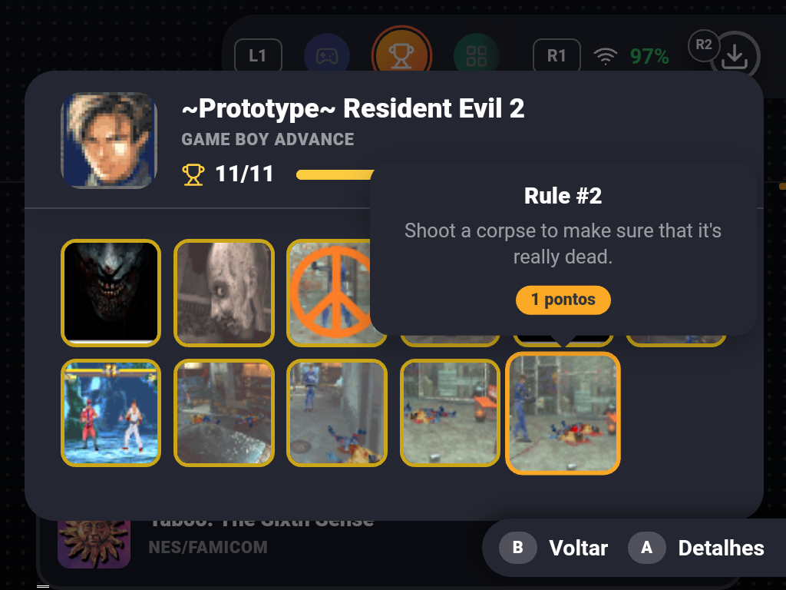
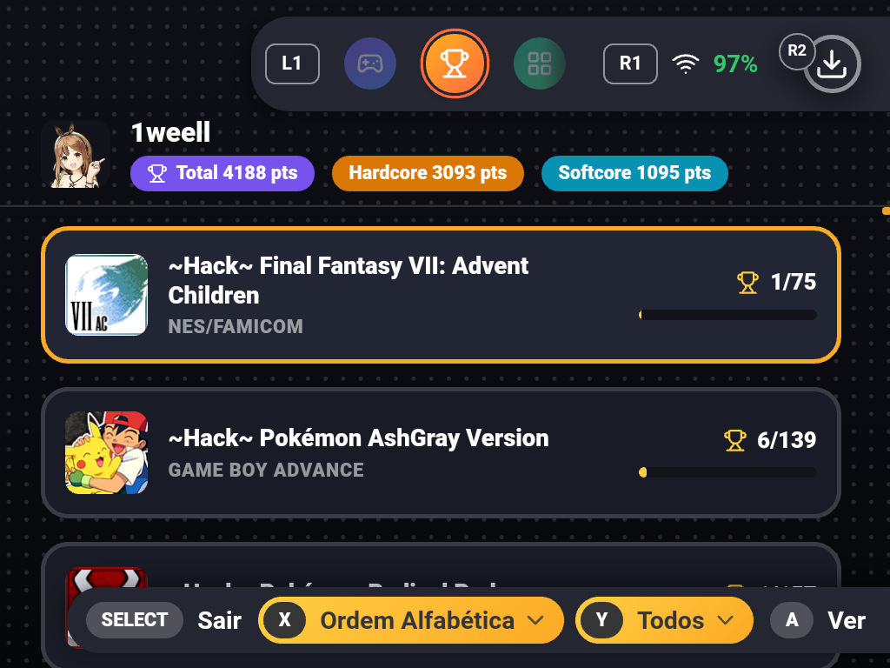

# ZNeko Launcher

**A simpler way to manage, transfer, and play games across Android handhelds.**

[Features](#features) • [Installation](#installation) • [ZNeko Link](#zneko-link) • [Why ZNeko Exists](#why-zneko-exists)

---

## What is ZNeko Launcher?

ZNeko is an emulation frontend and device-management ecosystem built primarily for Android handhelds.

Most frontends are built around a single device, so every new handheld means rebuilding the same libraries, emulators, artwork, and settings from scratch. **ZNeko is built for managing multiple handhelds.** Your games, artwork, presets, and backups live on your computer and flow to any handheld you pair.

Setup is designed to take moments, not an evening. Boot a fresh device, pair it with ZNeko Link, and transfer a game. When you select it, pick an emulator from the supported list and the launcher uses it if already installed. After the emulator's initial setup you are ready to play. ZNeko Link also lets you browse your full library from the handheld, even for games not currently stored on it.

You do not have to use every part of the ecosystem. ZNeko also works alongside other frontends, purely for wireless transfers, emulator updates, backups, or as a controller-friendly launcher.

The goal is simple: make Android handheld management faster, easier, and less fragmented.

> [!IMPORTANT]
> ZNeko is still in a very early pre-alpha stage.
>
> The launcher is already usable, but there is still a lot of work ahead. Bugs, incomplete features, compatibility issues, and breaking changes should be expected. Support for emulators will grow over time.

> [!WARNING]
> ZNeko is a **frontend**, not an emulator.
>
> It does not bundle games, ROMs, BIOS files, emulator cores, encryption keys, or standalone emulators.
>
> ZNeko can download supported standalone emulators from their official sources, but they remain separate applications maintained and distributed by their respective developers. You must provide your own legally obtained content.

---

## Showcase

  
   
  Running on an <b>AYANEO Air Mini</b>

 

---

 

  
  

  
  
   
  Running on an <b>AYANEO Pocket FIT</b>

 

---

 

  
  

  
  
   
  Running on a <b>XU20 V32</b> 
  <i>(yes, even on devices with very limited screen space)</i>

## Features

### ZNeko Launcher

- **Easy setup**  
  Get started as fast as possible. No long setup wizard, no complicated library import process.

- **Built for Android handhelds across a wide range of sizes and performance levels**  
  Designed for controller-first use across small and large screens, with a strong focus on lower-end hardware. ZNeko was tuned to remain usable on devices such as the XU20 V32 and Mini Zero 28, and performs especially well on devices starting around the AYANEO Air Mini class.

- **Game and folder artwork tools**  
  Search SteamGridDB and ScreenScraper.fr for high-quality artwork, or use ZNeko's custom local image picker to customize game icons, heroes, logos, and folder artwork.

- **RetroAchievements integration**  
  View achievement progress directly within your game library, plus access a dedicated achievements hub with cross-filtering by platform and sorting by recent activity, completion percentage, or alphabetical order.

- **Flexible folder-to-emulator assignment**  
  Your folder names do not matter. Assign any supported emulator to any game folder in just a couple of steps.

- **Customizable app sounds**  
  Replace default navigation sound effects and background music with your own custom audio files directly from device storage.

- **Obtainium-like emulator updates, built in**  
  Download and update supported standalone emulators directly from their official sources without leaving ZNeko *(currently limited to a few supported emulators during pre-alpha)*.

### Paired With ZNeko Link

- **Wireless ROM transfers**  
  Transfer games that you already own from your computer to your handheld over your local network.

- **Syncthing-like synchronization, without the headaches**  
  Move emulator saves, artwork, configuration files, and other folders between devices through simple manual imports and exports, with no persistent "out of sync" state and far less risk of conflicts.

- **Automatic discovery**  
  ZNeko Launcher automatically finds ZNeko Link on the same network, with no IP address or QR-code setup required.

- **Device pairing**  
  The first connection must be approved on your computer, with a matching code shown on both screens. Only devices you approve can access your library, and access can be revoked at any time.

- **No cloud dependency**  
  Transfers and synchronization happen directly over your local network. No accounts, no third-party servers.

---

## Installation

Download the latest APK from the [Releases page](https://github.com/zneko-org/zneko-launcher/releases).

> [!NOTE]
> ZNeko is currently distributed outside the Google Play Store. Android may ask you to allow installation from your browser or file manager.
>
> Only the latest version is kept on the Releases page. This is intentional, since older pre-alpha builds may contain known issues, incompatible data formats, or outdated behavior.
>
> After installation, ZNeko's built-in updater can check for and install future releases directly from its official source.

---

## ZNeko Link

**ZNeko Link** is the companion desktop application for Windows and macOS.

Check out the [ZNeko Link repository](https://github.com/zneko-org/zneko-link) for downloads, setup instructions, and additional information.

---

## Why ZNeko Exists

ZNeko is a personal project built by a single developer during my 2026 vacation.

I've been interested in Windows, Android, and Linux handhelds since 2022. Over the years, I've owned and tested many of them, along with a wide range of emulation frontends and other software.

Many of these are excellent.

The problem I kept running into was repetition: owning several Android handhelds meant spending a lot of time configuring the same libraries, emulators, artwork, folders, and settings on every device.

That frustration became the starting point for ZNeko.

I wanted a launcher that was quick to set up, easy to move between devices, and focused on getting into a game with as little friction as possible. ZNeko Link, wireless transfers, backups, reusable configurations, and the launcher itself all grew from that goal.

The visual direction was also a personal challenge.

UsagiShade's frontend concept video looked like exactly the kind of interface that could become a frontend developer's nightmare: layered artwork, controller-first navigation, responsive layouts, animations, and many small visual details working together.

As a frontend developer, I wanted to see whether I could build my own interpretation of that kind of experience.

The project eventually reached a point where it felt useful and interesting enough to share publicly.

ZNeko is free and will remain free, without advertisements, subscriptions, paywalled content, or paid feature locks.

I may eventually open a support page for anyone who voluntarily wants to support continued development, but donations will never be required to use the launcher or access any of its features.

### What to Expect

Because ZNeko is maintained by one person in their spare time, there is no fixed release schedule. Updates land when they are ready, and some weeks will be quieter than others. The project is actively developed and I use it daily on my own devices, so fixes for anything that breaks my own setup tend to arrive quickly.

Bug reports and feature requests are welcome through [GitHub Issues](https://github.com/zneko-org/zneko-launcher/issues). Please include your device model, Android version, and the launcher/Link versions. Only the latest release is supported.

---

## Acknowledgements and Design Influences

ZNeko is independently developed, but its design and feature set were shaped by many projects across the retro-handheld and emulation-frontend community.

- **[UsagiShade / iiSU concept video](https://www.youtube.com/watch?v=bpTpCR1IUts)**  
  A major inspiration for ZNeko's library presentation.

- **The broader retro-handheld and emulation software ecosystem**  
  Many of ZNeko's features and interaction patterns were influenced by years of using and testing frontends, launchers, emulator managers, update tools, synchronization utilities, and other handheld-focused software. These experiences helped shape ZNeko's approach to library organization, emulator setup, artwork customization, controller navigation, scraping, backups, updates, file transfers, and multi-device workflows.

- **SteamGridDB & ScreenScraper.fr**  
  Provide community-made game artwork and retro gaming metadata used by ZNeko's artwork search and scraping features.

These projects and communities helped shape ZNeko's direction.

ZNeko does not use code or bundled assets from the projects listed above, except for artwork explicitly retrieved from SteamGridDB and ScreenScraper.fr through their official services. Its implementation, Android launcher integration, ZNeko Link workflow, ROM transfers, backup system, and other features were developed independently.

