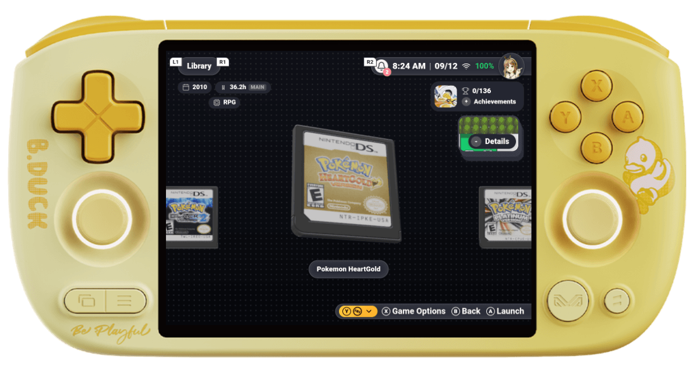
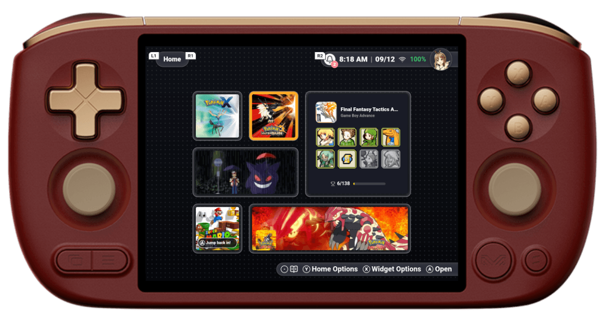
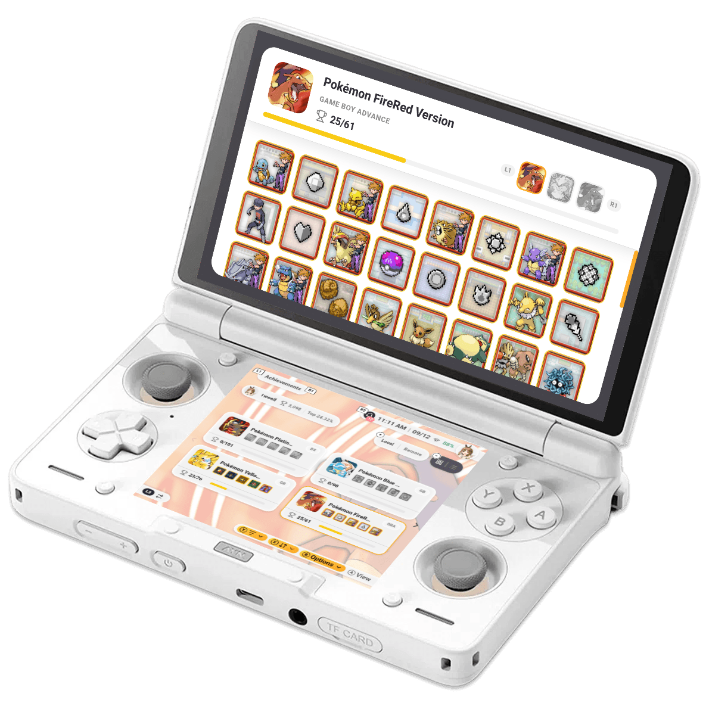
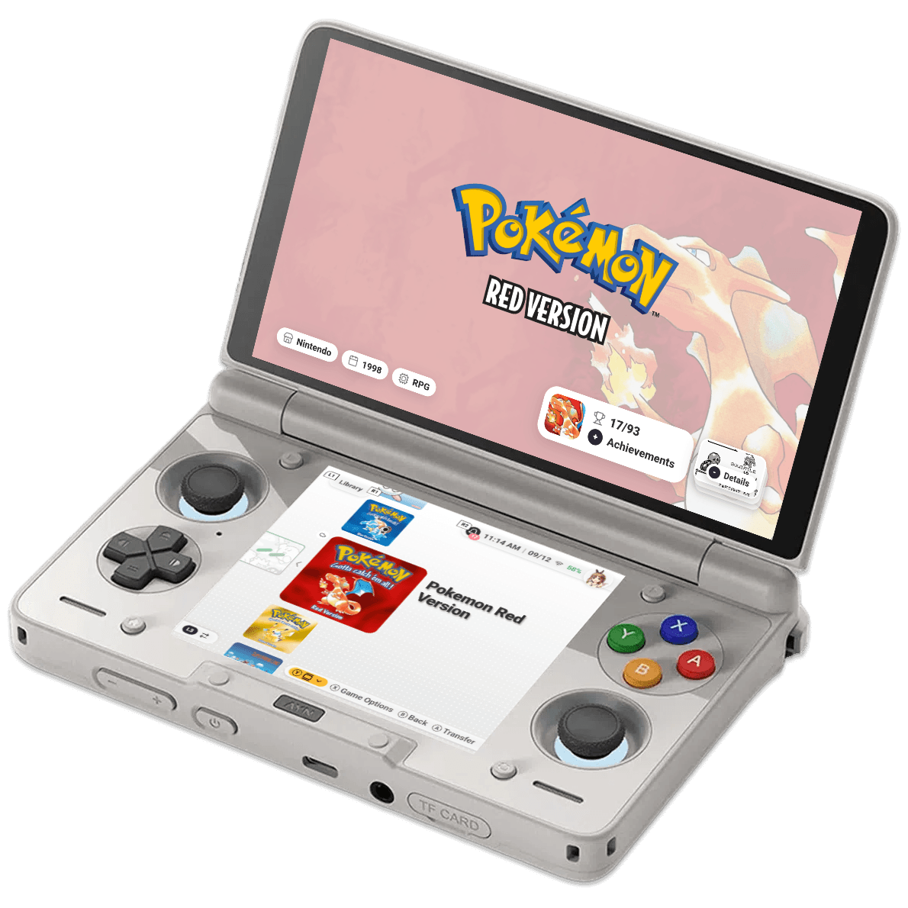

# ZNeko Launcher

**A simple, powerful way to manage, discover, and play games across Android devices.**

  
  
  

[ZNeko Link](https://github.com/zneko-org/zneko-link) • [S3 Setup](S3_SETUP.md)

[What is ZNeko Launcher?](#what-is-zneko-launcher) • [Preview](#preview) • [Features](#features) • [Performance and Compatibility](#performance-and-compatibility) • [Acknowledgements](#acknowledgements)

---

## What is ZNeko Launcher?

ZNeko Launcher is an emulation frontend for Android devices, supporting both standard and dual-screen systems, with touch and gamepad input.

Android has never had more frontend options, but many of them have also become increasingly difficult to approach. Complex configuration, convoluted workflows, and inconsistent behavior can make it hard to get everything working the way you want.

ZNeko takes the opposite approach. It is quick to set up and stays out of your way, while still carrying the depth you would expect from a much heavier frontend.

Its library and home screen design were influenced by **[iiSU](https://iisu.network)**, and Physical View follows a concept introduced by **[Socket](https://depmots.com/socket)**.

And it is free with no ads. [Donations](https://ko-fi.com/gustavokei) are welcome, but they do not buy anything. Everyone gets the same launcher.

---

## Preview

  
  

  
  

---

## Features

### Home

- **Widgets** - Create your own dynamic home with a variety of custom widgets.

- **Customize with ease** - Pick media without having to leave the app.

### Library

- **Automatic and flexible**
  - Most platforms are automatically detected.
  - Adding a new platform requires no tedious setup: simply open a folder or launch a game and ZNeko will guide you through the process.
  - Supports both parent folders (e.g., a root ROMs folder with subfolders like ROMs/gba) and standalone platform folders (e.g., GBA).
  - You're free to name your folders the way you want.

- **Emulator Support**
  - Supports most major emulators available on Android.
  - **Vita3K Emulator Integration** - Users can point ZNeko to the same path configured in `Settings > Emulator > Emulated System Storage Folder` as a standalone folder. Games will then be detected automatically, without the need to create `.psvita` or `.dpt` shortcuts (these shortcut formats are also supported).
  - If the emulator is not found by ZNeko, you can request its implementation [here](https://github.com/zneko-org/zneko-launcher/issues) or add it manually (and even share your `assets/custom-emulators.json` configurations with other users).

- **Virtual Android Folders** - Create custom Android app folders for games, emulators, tools, and more. ZNeko also supports **app shortcuts**, allowing you to add games from apps like **GameNative, GameHub, and GameHub Lite** to your library folders and home widgets (ZNeko must be set as the default launcher).

- **Multiple View Modes** - Switch between Vertical, Horizontal, Physical, and Standard view modes.

- **Multi-Disc Support** - M3U playlists and "(Disc N)" naming conventions are automatically handled.

- **Detailed Game Information** - See and customize detailed information about each game, including: synopsis, screenshots, videos, developers, publishers, ratings, release dates, and more.

- **Playtime tracking** - Track your playtime for each game.

### RetroAchievements

ZNeko offers deep RetroAchievements integration, bringing detailed achievement data and account features directly into your game library.

* View achievements for games stored on your device or linked to your **RetroAchievements account**.
* Filter achievements and games by platform (**Arcade, Dreamcast, Game Boy, and more**).
* Sort by **recently unlocked, completion rate, or alphabetical order**.
* Browse **achievement subsets**.
* View detailed RetroAchievements metadata, including **achievement types** (Missable, Progression, Win Condition), **Hardcore vs. Casual mode**, unlock dates, unlock rates, and more.
* Track your progress and explore achievement data without leaving the app.

### ZNeko Link + S3-Compatible Storage

Both integrations allow you to transfer games, saves, or any folders to and from other devices, without having to set up a full server.

Games stored on Link or S3 are treated as local library entries, allowing you to see their artwork, metadata, achievements, and more without transferring them first.

**ZNeko Link** is a companion desktop application for Windows and macOS. Check out the [ZNeko Link repository](https://github.com/zneko-org/zneko-link) for downloads, setup instructions, and additional information.

**S3 storage** is self-hosted/user-provided; see [S3 Setup](S3_SETUP.md) for setup details.

## Performance and Compatibility

ZNeko Launcher is designed to run well across a broad range of Android hardware, including inexpensive handhelds. The project is regularly tested on devices ranging from entry-level, ~$100 handhelds (such as RG Rotate and Ayaneo Pocket Air Mini) to modern flagship hardware.

It requires Android 7.0 or higher, though very low-end devices (such as the MagicX XU20 V32) may still experience reduced performance.

---

## Acknowledgements

- **[RetroAchievements](https://retroachievements.org)**  
  Provides the achievement sets, player progress, and badge artwork shown in the library and the achievements hub, through its official Web API using your own account key.

- **[SteamGridDB](https://www.steamgriddb.com)** & **[ScreenScraper.fr](https://www.screenscraper.fr)**  
  Provide community-made game artwork and retro gaming metadata used by ZNeko's artwork search and scraping features.

- **[iiDB](https://iidb.iisu.network/)** & **[iiSU Workshop](https://assets.iisu.community/)** 
  A catalogue of community-contributed reference assets, including game and platform artwork and soundbites, browsed through its own site inside ZNeko. Those assets remain the property of their respective owners.

- **[HowLongToBeat](https://howlongtobeat.com)**  
  The source of the completion times shown on game details. ZNeko does not crawl the site. It imports a publicly available completion-time dataset.

- **[Swiper](https://swiperjs.com)** 
  Touch-enabled carousels and page navigation used throughout the launcher. MIT License.

- **[Lucide Icons](https://lucide.dev)**  
  Icons used throughout the UI. ISC License (see [lucide.dev/license](https://lucide.dev/license)).

- **"ticology" sound pack by granfdad**  
  Default UI sound effects used in ZNeko Launcher (licensed under [CC BY 4.0](https://creativecommons.org/licenses/by/4.0/); see [permission confirmation](sounds-attr.png)).

- **Physical media 3D models**  
  Physical View downloads credited, freely licensed cartridge and disc models hosted in this repository. See the complete [model attribution and license list](models/ATTRIBUTION.md).

ZNeko does not use code or bundled assets from the projects listed above except for the permissively licensed Swiper and Lucide UI libraries. Other exceptions are content retrieved through official services at your request, namely achievement data from RetroAchievements, artwork and metadata from SteamGridDB and ScreenScraper.fr, artwork and soundbites from iiDB and iiSU Workshop, the offline HowLongToBeat completion-time dataset, the CC BY 4.0 licensed navigation sounds, and the [credited physical-media models](models/ATTRIBUTION.md) downloaded by Physical View. Its implementations were developed independently.
