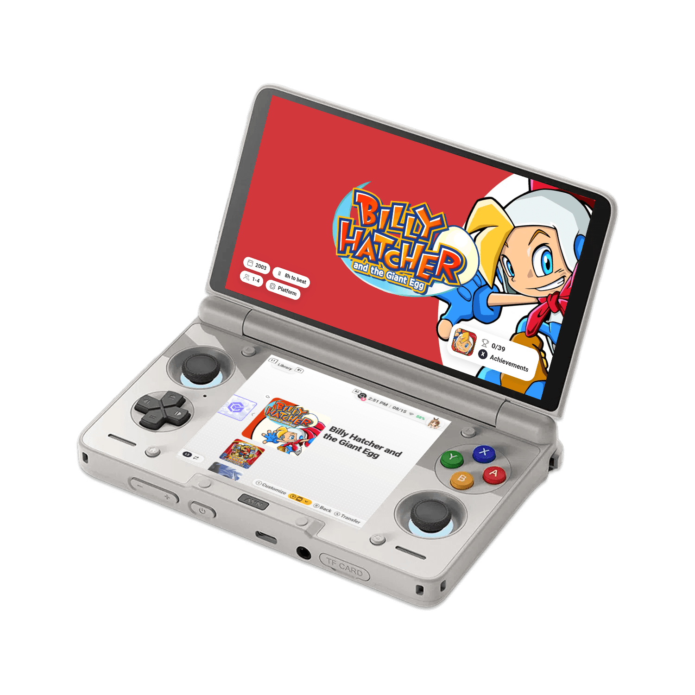
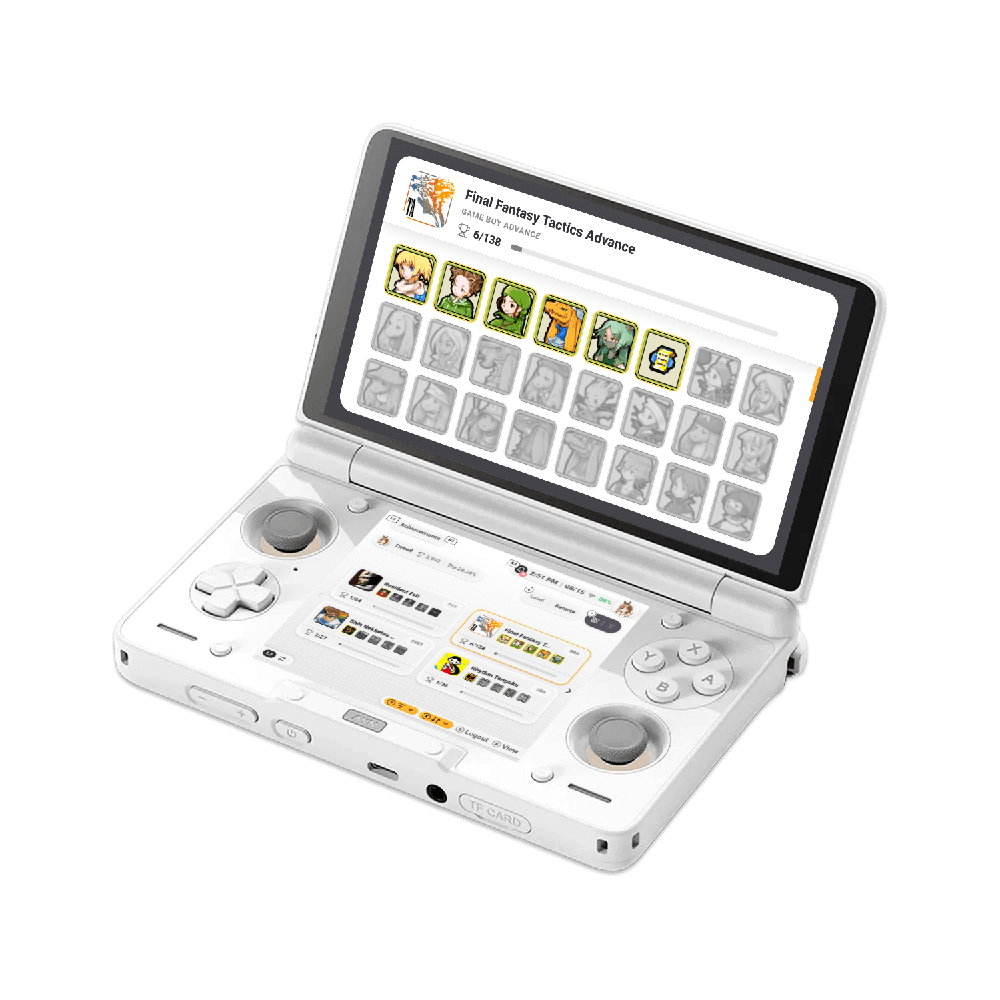
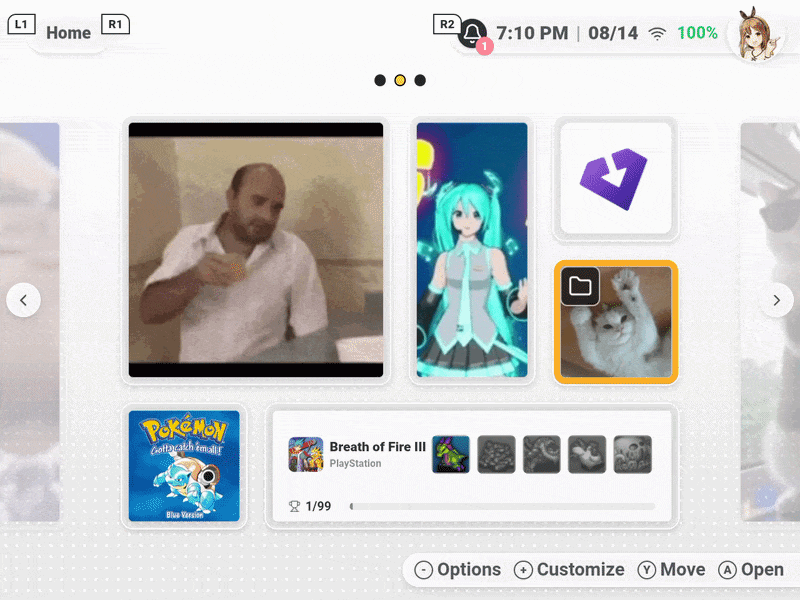
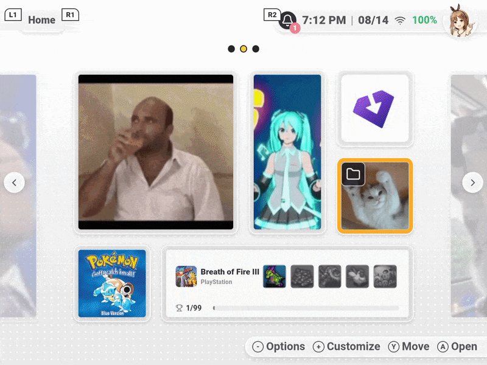
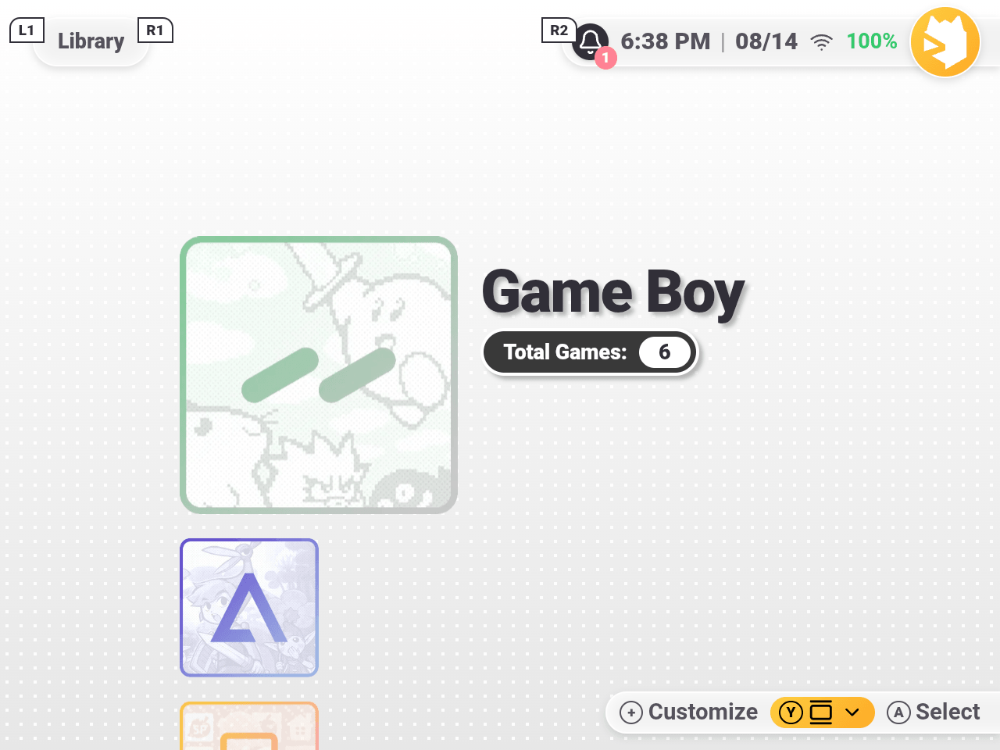
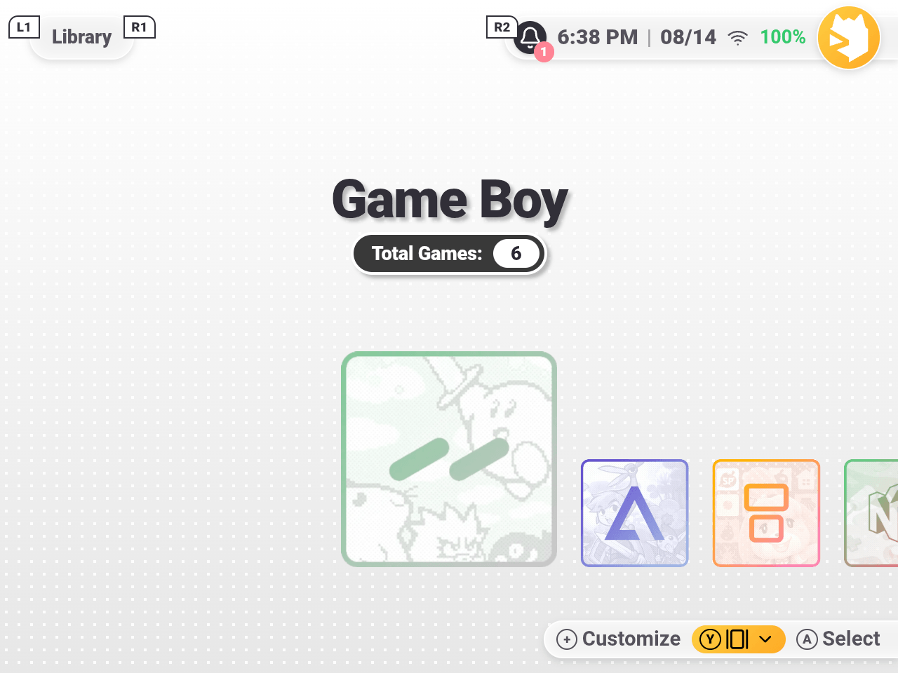
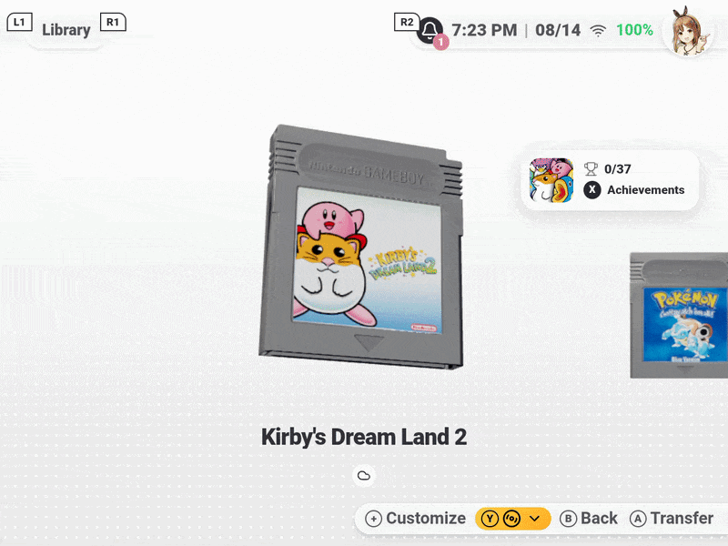
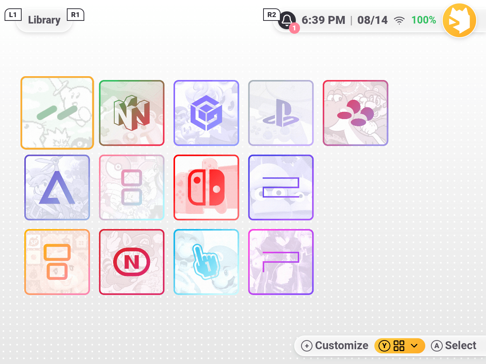

# ZNeko Launcher

**A simpler way to manage, transfer, and play games across Android handhelds.**

[Installation](#installation) • [ZNeko Link](#zneko-link)

---

## What is ZNeko Launcher?

ZNeko Launcher is an emulation frontend for both single and dual screen Android devices.

Android has never had more frontend options, but many of them have also become increasingly difficult to approach. Complex configuration, convoluted workflows, and inconsistent behavior can make it hard to get everything working the way you want.

ZNeko takes the opposite approach. It is quick to set up and stays out of your way, while still carrying the depth you would expect from a much heavier frontend: a customizable home dashboard, four library views including 3D physical media, artwork and metadata from several catalogues, RetroAchievements progress, and desktop pairing through ZNeko Link.

ZNeko's library and home presentation is heavily influenced by **[iiSU](https://iisu.network)**, and Physical View follows a concept introduced by **[Socket](https://depmots.com/socket)**. Both are credited in full under [Acknowledgements](#acknowledgements-and-design-influences).

And it is free with no ads. Every feature ships to everyone at the same time, at no cost, and it will stay that way. Donations are welcome, but they do not buy anything. Everyone gets the same launcher.

> [!IMPORTANT]
> ZNeko is in an alpha stage.
>
> The launcher is already very usable, but there is still a lot of work ahead. Bugs, incomplete features, compatibility issues, and breaking changes should be expected. Support for emulators will grow over time.

---

## What ZNeko Focuses On

- **Free on Google Play.** ZNeko is on the Play Store as an open test, at no cost and with no paid tier. Direct APK downloads and Obtainium are there for anyone who prefers them.

- **Desktop pairing through ZNeko Link.** Games still on your computer appear in the library before they are transferred. Move a single game, a folder, or an entire library across the local network. The same pairing moves anything else you point it at, including emulator saves, artwork, and configuration files, through manual imports and exports rather than a background sync.

- **A built-in web asset picker.** Set artwork for any game, folder, or Home tile by browsing image sources from inside the launcher, with no account or API key needed. Each source is embedded as its own site, and you pick a single asset from it. It works the same way across Home and the entire library.

- **RetroAchievements, before you play.** Plenty of frontends show achievements. ZNeko matches every game sitting on your device against RetroAchievements whether or not you have played it, so you can see what a game has on offer before starting it. Filter by platform, sort by completion, name, or recent activity, and correct a bad match from the Library.

- **Built for older and weaker hardware.** ZNeko installs on Android 7.0 and up, and development is done against real Android 10 devices rather than emulators. A Unisoc T618 with 3 GB of RAM is the baseline it is tuned against, and the UI is checked on screens from the RG Rotate up to the Konkr Pocket Fit. Weaker devices may still run it, but they are not what performance is measured on.

- **Minimal setup, minimal navigation.** Setup is two paths: an assets folder and one or more parent ROM folders. Launching is two clicks, since folders are matched to their system automatically and ZNeko detects the supported emulators you already have installed. Settings live behind one entry point rather than scattered across the app, nested menus carry a breadcrumb, switching library views is a single button, and the footer always lists what the buttons do.

---

## Showcase

  
  

---

## Features

### ZNeko Launcher

#### Home

  
  

Home is a personal dashboard. Build it from resizable tiles for games, installed Android apps, images, GIFs, videos, folders, and lightweight widgets such as **Last Played** and **RetroAchievements progress**. Arrange everything across multiple boxes with either a controller or touch, then resize and customize each tile to suit the screen and the way you play.

#### Library

  
  

  
  

Choose between a standard grid, vertical rail, horizontal rail, or **Physical View** while keeping artwork, metadata, completion times, soundbites, and achievement progress close at hand. When paired with ZNeko Link, games stored on your computer appear in the same library and can be transferred when you are ready to play.

**Physical View** trades flat covers for real 3D media. Each game is shown as the cartridge or disc its system actually shipped on, with your own artwork printed onto the label. The models are downloaded on demand instead of being bundled, so they cost nothing until you use the view.

Each game and folder can be customized independently with covers, heroes, logos, metadata, and audio. For manual selection, artwork and soundbites from various sources can be browsed and picked from within ZNeko using a simple touch/hold interaction, with no account, API key, or other credentials required.

For automatic collection, ZNeko also supports traditional scraping: configure a **SteamGridDB** API key and **ScreenScraper** account to fill missing artwork and metadata, while **HowLongToBeat** supplies completion times. You can also import artwork, metadata, and better search names from an existing **ES-DE** setup.

#### Achievements

  
  

Connect your own **RetroAchievements** account to see progress across supported systems and emulators. Two scopes are available. **Local** matches the games actually sitting on your device against RetroAchievements, including ones you have never launched, so you can see what a game has on offer before starting it. **Remote** lists the games your RetroAchievements account already has progress on, whether or not they are on this device.

Either scope can be shown as a grid of four cards or four rows per page, filtered by console, and sorted by recent activity, completion, or name. Opening a game gives the full badge view with descriptions, points, rarity, and unlock dates. Games can also be matched or corrected from the Library when an automatic match is not enough.

### Paired With ZNeko Link and S3 Storage

Games can live on your computer through **ZNeko Link**, in an **S3-compatible bucket** you provide — Backblaze B2, Amazon S3, Cloudflare R2, Wasabi, or a server you run yourself — or both at once. Either way they behave the same in the Library.

- **Your entire game library, on every Android device**  
  Games still on your computer or in your bucket appear alongside the ones already installed. You can manage their artwork and metadata, browse details, and even view achievements directly from your Android device without transferring them first. When you’re ready to play, transfer a single game, a folder, or queue your entire remote library.

  

- **Move files between devices**  
  Move emulator saves, artwork, configuration files, and other folders between devices through simple manual imports and exports.

- **Folder backups**  
  Pair a folder on your Android device with a backup in your bucket and export it whenever you like — emulator saves, configuration, anything you would not want to lose with the SD card.

Set the bucket up with [S3_SETUP.md](S3_SETUP.md), then manage everything from **Settings → Backups**.

> [!WARNING]
> ZNeko Launcher is a **frontend**, not an emulator or a source of games.
>
> ZNeko can download supporting content from credited online services, including artwork, metadata, achievement data, and completion times. It does not download or bundle games, ROMs, BIOS or other system files, encryption keys, emulator cores, or standalone emulators.
>
> ZNeko Link transfers only files that are already stored on your own computer, across your local network, to a device you approved. S3 storage moves only files you put in a bucket you own, through credentials you supply, ZNeko hosts nothing and operates no storage of its own. Emulators are separate applications maintained and distributed by their respective developers. Install them separately, then bind them to your folders. You must provide your own legally obtained games and system files.

---

## Installation

ZNeko is live on Google Play, currently as an **open test** only. Join the test to install it from the Play Store, download the latest APK from the [Releases page](https://github.com/zneko-org/zneko-launcher/releases), or add ZNeko to [Obtainium](https://github.com/ImranR98/Obtainium) to get every future release automatically:

  
  

> [!NOTE]
> Play Store updates can take longer to ship, since every build has to clear Google's review and testing policies. If you want the most up to date version, use the [Releases page](https://github.com/zneko-org/zneko-launcher/releases) or Obtainium instead.
>
> Only the latest version is kept on the Releases page. This is intentional, since older alpha builds may contain known issues, incompatible data formats, or outdated behavior.

---

## ZNeko Link

**ZNeko Link** is the companion desktop application for Windows and macOS.

Check out the [ZNeko Link repository](https://github.com/zneko-org/zneko-link) for downloads, setup instructions, and additional information.

---

## S3 Storage

ZNeko can connect to any **S3-compatible storage you provide**, as a second place to keep games and folder backups. The bucket is yours: keys are stored on your device, requests are signed there, and nothing is routed through a ZNeko service.

Any S3-compatible provider should work, though **Backblaze B2** is the only one tested so far — its free tier is generous and needs no credit card. Read [S3_SETUP.md](S3_SETUP.md) for a step-by-step guide.

---

## Why ZNeko Exists

ZNeko started in late 2025, after I came across **[UsagiShade's concept video for iiSU](https://www.youtube.com/watch?v=bpTpCR1IUts)**. At first, it was a personal challenge: as a web developer with little Android experience, I wanted to see if I could build something with the kind of interactions shown in the video.

That challenge quickly turned into experimenting with Android development, learning the platform, and thinking about what I actually wanted from an emulation frontend.

I've been interested in Windows, Android, and Linux handhelds since 2022. Over the years, I've owned and tested many of them, along with a wide range of emulation frontends and other software.

Many of these are excellent.

The problem was twofold: many frontends were difficult to use, and owning multiple Android handhelds meant repeating that friction on every device. That frustration became a big part of what I wanted ZNeko to solve.

I wanted a launcher that was quick to set up, easy to move between devices, and focused on getting into a game with as little friction as possible, while still being visually engaging.

During my 2026 vacation, I finally had the time to push the project much further. What had started as a small development challenge grew into the launcher and companion tools you see today, and development has continued steadily since.

The project eventually reached a point where it felt useful and interesting enough to share publicly.

If you enjoy ZNeko and want to support its continued development, you can support the project on [Ko-fi](https://ko-fi.com/gustavokei). Donations are entirely optional and will never be required to use the launcher or access any of its features.

### What to Expect

Because ZNeko is maintained by one person in their spare time, there is no fixed release schedule. Updates land when they are ready, and some weeks will be quieter than others. The project is actively developed and I use it daily on my own devices, so fixes for anything that breaks my own setup tend to arrive quickly.

Bug reports and feature requests are welcome through [GitHub Issues](https://github.com/zneko-org/zneko-launcher/issues). Please include your device model, Android version, and the launcher/Link versions. Only the latest release is supported.

---

## Acknowledgements and Design Influences

### Design influences

- **[iiSU](https://iisu.network)**  
  iiSU is the biggest single influence on ZNeko's library and home presentation. ZNeko is its own app underneath it: written from scratch and tuned for low to mid range Android hardware, carrying four library views, the Home dashboard, controller first navigation, the achievements hub/integration, and the ZNeko Link transfer workflow.

- **[Socket](https://depmots.com/socket) by depmots**  
  Physical View follows Socket's idea of browsing a collection as physical media, with per-platform 3D cartridges and discs. The concept is Socket's. ZNeko's implementation and animations are its own, and its models are freely licensed community models credited in the [model attribution list](models/ATTRIBUTION.md).

- **The broader retro-handheld and emulation software ecosystem**  
  Many of ZNeko's features and interaction patterns were influenced by years of using and testing frontends, launchers, emulator managers, update tools, synchronization utilities, and other handheld-focused software. These experiences helped shape ZNeko's approach to library organization, emulator setup, artwork customization, controller navigation, scraping, backups, updates, file transfers, and multi-device workflows.

### Data, content, and libraries

- **[RetroAchievements](https://retroachievements.org)**  
  Provides the achievement sets, player progress, and badge artwork shown in the library and the achievements hub, through its official Web API using your own account key.

- **[iiDB](https://iidb.iisu.network/)** 
  A catalogue of community-contributed reference assets, including game and platform artwork and soundbites, browsed through its own site inside ZNeko. Those assets remain the property of their respective owners.

- **[SteamGridDB](https://www.steamgriddb.com)** & **[ScreenScraper.fr](https://www.screenscraper.fr)**  
  Provide community-made game artwork and retro gaming metadata used by ZNeko's artwork search and scraping features.

- **[iiSU Workshop](https://assets.iisu.community/)**  
  A community catalogue of artwork and soundbites that ZNeko can browse when filling a game's asset slots.

- **[HowLongToBeat](https://howlongtobeat.com)**  
  The source of the completion times shown on game details. ZNeko does not crawl the site. It imports a publicly available completion-time dataset.

- **[Swiper](https://swiperjs.com)** 
  Touch-enabled carousels and page navigation used throughout the launcher. MIT License.

- **[Lucide Icons](https://lucide.dev)**  
  Icons used throughout the UI. ISC License (see [lucide.dev/license](https://lucide.dev/license)).

- **"ticology" sound pack by granfdad**  
  Default UI sound effects used in ZNeko Launcher (licensed under [CC BY 4.0](https://creativecommons.org/licenses/by/4.0/); see [permission confirmation](sounds-attr.png)).

- **Physical media 3D models**  
  Physical View downloads credited, freely licensed cartridge and disc models hosted in this repository. See the complete [model attribution and license list](models/ATTRIBUTION.md).

ZNeko does not use code or bundled assets from the projects listed above except for the permissively licensed Swiper and Lucide UI libraries. Other exceptions are content retrieved through official services at your request, namely achievement data from RetroAchievements, artwork and metadata from SteamGridDB and ScreenScraper.fr, artwork and soundbites from iiDB and iiSU Workshop, the offline HowLongToBeat completion-time dataset, the CC BY 4.0 licensed navigation sounds, and the [credited physical-media models](models/ATTRIBUTION.md) downloaded by Physical View. Its implementation, Android launcher integration, ZNeko Link workflow, game transfers, backup system, and other features were developed independently.
