

# ZNeko Launcher

**A simpler way to manage, transfer, and play games across Android handhelds.**

[Features](#features) • [Installation](#installation) • [ZNeko Link](#zneko-link) • [Why ZNeko Exists](#why-zneko-exists)

---

## What is ZNeko Launcher?

Android has never had more frontend options, but many of them have also become increasingly difficult to approach. Complex configuration, convoluted workflows, and inconsistent behavior can make it hard to get everything working the way you want.

ZNeko takes the opposite approach.

First-time setup is a single screen with just two paths to configure: where your games are and where ZNeko keeps its assets.

  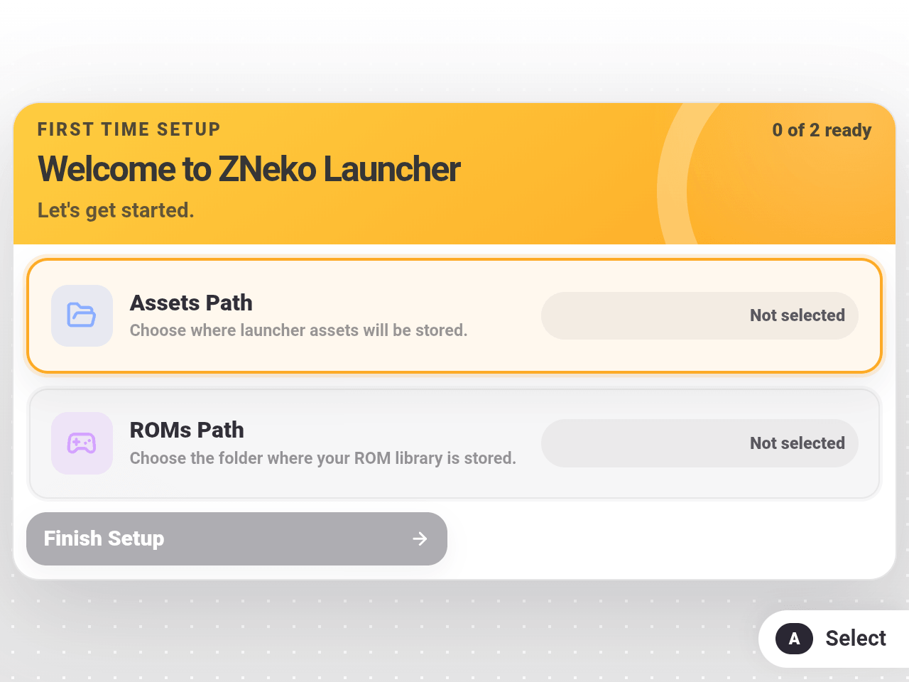

From there, everything is designed to be easy to understand at a glance. Actions, controls, and relevant information are kept visible when you need them, with focused and consistent menus instead of layers of configuration.

  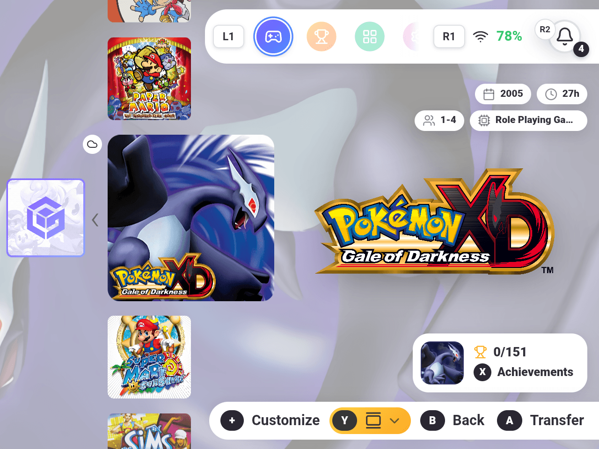
  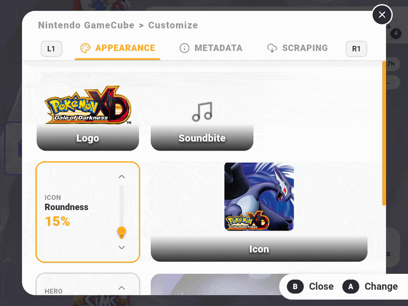

For users with multiple devices, **ZNeko Link** is an optional companion application that runs on your computer. Everything it does happens over your own local network, between your own machines: browse your entire game library from the handheld, including games that are not currently stored on it, pull one across when you want to play it, and import or export saves and assets in either direction. Setup is just two steps: choose a folder and approve the device connection.

> [!IMPORTANT]
> ZNeko is still in a very early pre-alpha stage.
>
> The launcher is already usable, but there is still a lot of work ahead. Bugs, incomplete features, compatibility issues, and breaking changes should be expected. Support for emulators will grow over time.

---

## Features

### ZNeko Launcher

- **Community art packs for your folders**  
  Browse **[Cocoon's Silk Pod](https://cocoon-shell.com/themes/)** smart folder packs without leaving the app. Downloading one repaints every matching folder with a coordinated icon, backdrop, and logo set.

  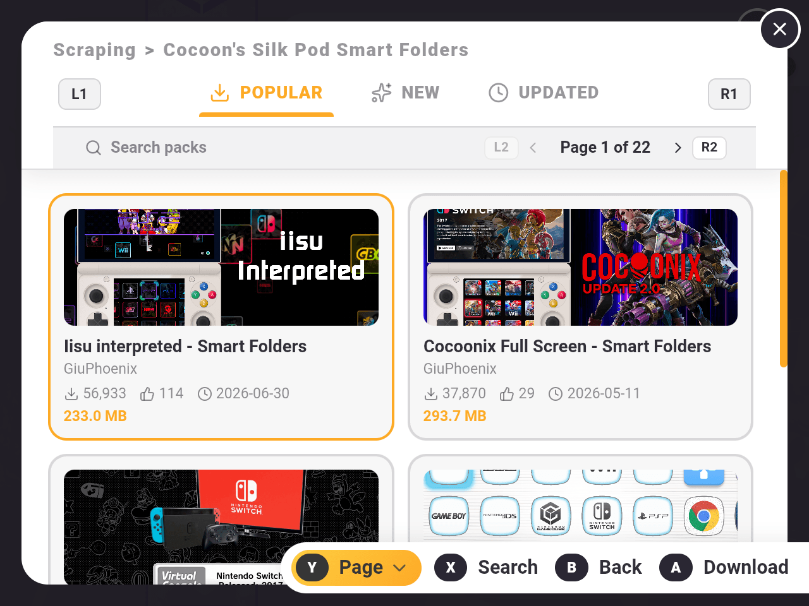

- **Assets without the usual limitations**  
  Artwork and soundbites come from the same picker. Alongside traditional scraper sources, ZNeko lets you browse and pick your own assets from the web directly inside the frontend. No API keys, no credentials. Soundbites are nothing new, but picking them is: this is the first frontend where you can browse a community catalogue of clips, listen to them, and assign one without ever leaving the app. Curious how? Open the asset picker and see for yourself.

  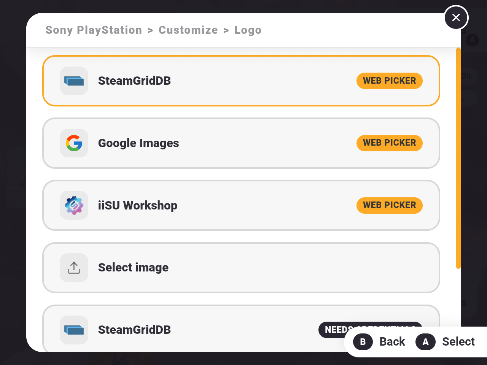

- **Import your existing ES-DE setup**  
  Point ZNeko at an ES-DE folder and it takes everything ES-DE already scraped: covers, backgrounds, and logos from `downloaded_media`, plus titles, release dates, genres, developers, publishers, player counts, and ratings from the gamelists. Only empty slots are filled, so nothing you already have is replaced, and systems named differently on each side still line up.

  This is also the fix for arcade libraries. A game could be `mvsc.zip`, a name no scraper recognises and one the emulator needs left exactly as it is, so the real title only exists inside ES-DE's gamelist. ZNeko imports that title as the game's search name, so arcade sets scrape correctly from then on and not a single file gets renamed.

  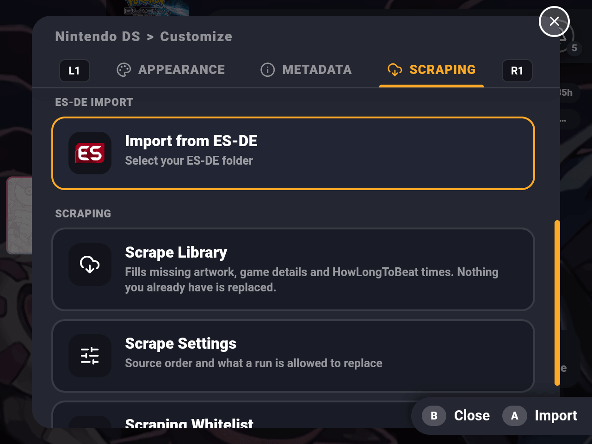

- **RetroAchievements integration**  
  View achievement progress directly within your game library, plus access a dedicated achievements hub with cross-filtering by platform and sorting by recent activity, completion percentage, or alphabetical order.

  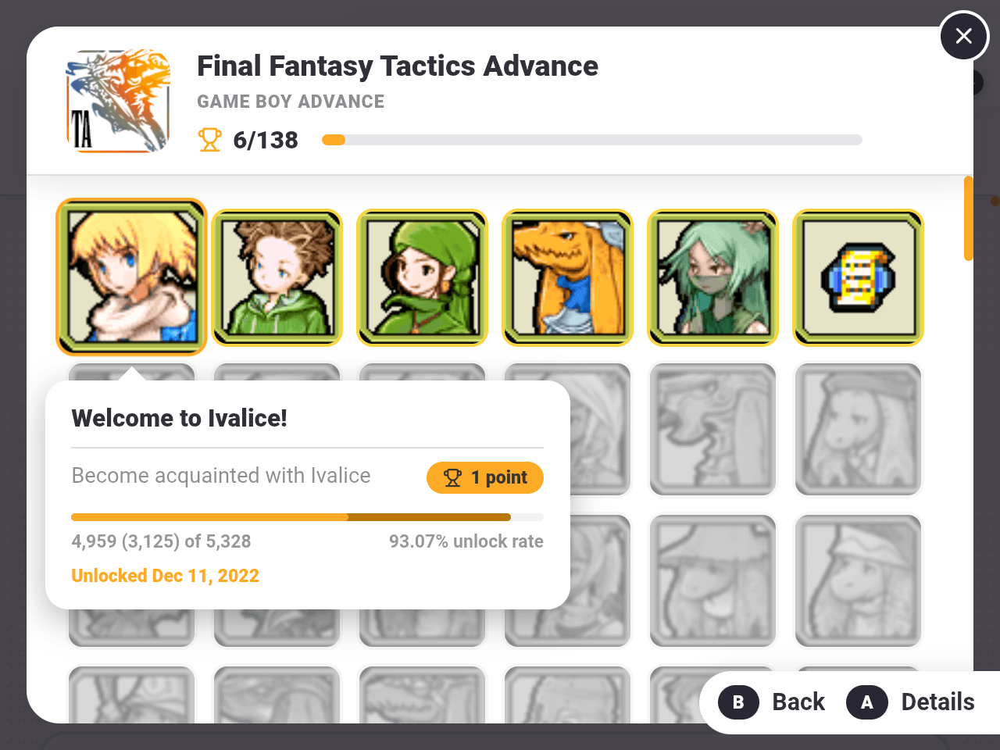
  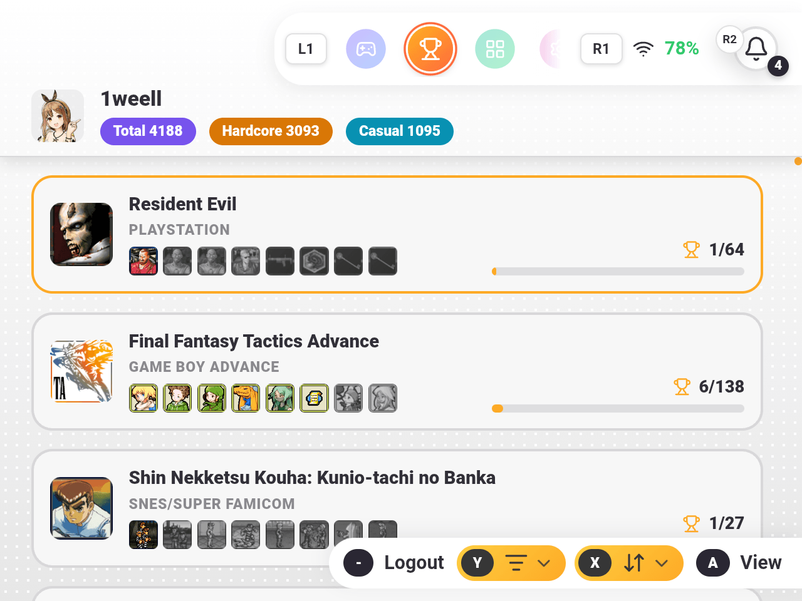

- **Two library layouts**  
  Switch the library between a vertical and a horizontal rail at any time from the footer. Both keep the artwork, metadata, and achievement progress of the highlighted game on screen, and your choice is remembered.

  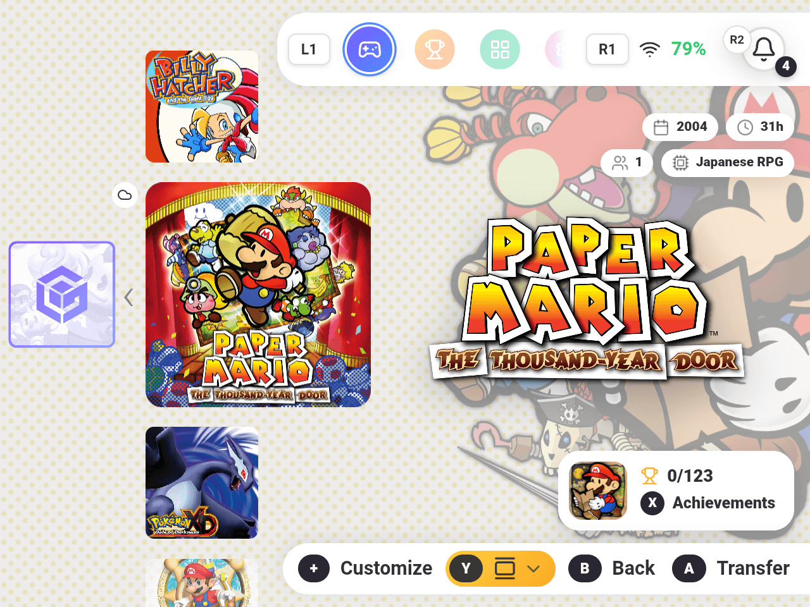
  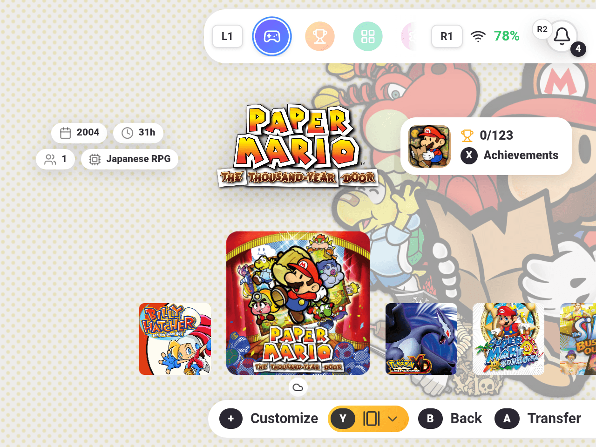

- **Built for Android handhelds of all sizes**  
  Designed for controller-first use across small and large screens, with performance tuned for handheld hardware. An UNISOC Tiger T618 chipset or equivalent is the recommended minimum for a smooth experience.

### Paired With ZNeko Link

- **Your entire game library, on every handheld**  
  Games still on your computer appear alongside the ones already installed. You can manage their artwork and metadata, browse details, and even view achievements directly from your Android device without transferring them first. **If you noticed a cloud icon next to any game in the screenshots above, that game wasn’t even on the device.** When you’re ready to play, transfer a single game, a folder, or queue your entire remote library.

  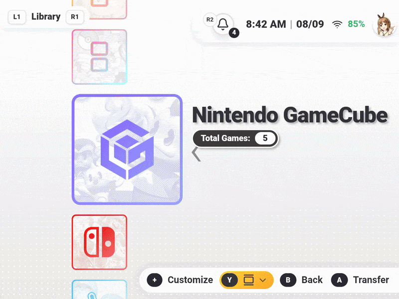

- **Syncthing-like synchronization, without the headaches**  
  Move emulator saves, artwork, configuration files, and other folders between devices through simple manual imports and exports, with no persistent "out of sync" state and far less risk of conflicts.

> [!WARNING]
> ZNeko Launcher is a **frontend**, not an emulator, and not a source of content.
>
> A transfer moves a file that is already sitting on your own computer, across your own local network, to a device you approved. There is no store, no catalogue, and no way for ZNeko to pull game content off the internet. Nothing is bundled either: no games, ROMs, BIOS files, emulator cores, encryption keys, or standalone emulators.
>
> Emulators are separate applications maintained and distributed by their respective developers. Install them yourself, then bind them to your folders. You must provide your own legally obtained content.

---

## Installation

Download the latest APK from the [Releases page](https://github.com/zneko-org/zneko-launcher/releases), or add ZNeko to [Obtainium](https://github.com/ImranR98/Obtainium) to get every future release automatically:

  

> [!NOTE]
> ZNeko is currently distributed outside the Google Play Store, with a **Google Play release currently in progress.**
>
> Only the latest version is kept on the Releases page. This is intentional, since older pre-alpha builds may contain known issues, incompatible data formats, or outdated behavior.

---

## ZNeko Link

**ZNeko Link** is the companion desktop application for Windows and macOS.

Check out the [ZNeko Link repository](https://github.com/zneko-org/zneko-link) for downloads, setup instructions, and additional information.

---

## Why ZNeko Exists

ZNeko started in late 2025, after I came across **[UsagiShade's frontend concept video](https://www.youtube.com/watch?v=bpTpCR1IUts)**. At first, it was a personal challenge: as a web developer with little Android experience, I wanted to see if I could recreate some of the ideas and interactions shown in the video.

That challenge quickly turned into experimenting with Android development, learning the platform, and thinking about what I actually wanted from an emulation frontend.

I've been interested in Windows, Android, and Linux handhelds since 2022. Over the years, I've owned and tested many of them, along with a wide range of emulation frontends and other software.

Many of these are excellent.

The problem was twofold: many frontends were difficult to use, and owning multiple Android handhelds meant repeating that friction on every device. That frustration became a big part of what I wanted ZNeko to solve.

I wanted a launcher that was quick to set up, easy to move between devices, and focused on getting into a game with as little friction as possible, while still being visually engaging.

During my 2026 vacation, I finally had the time to push the project much further. What had started as a small development challenge grew into the launcher and companion tools you see today, and development has continued steadily since.

The project eventually reached a point where it felt useful and interesting enough to share publicly.

If you enjoy ZNeko and want to support its continued development, you can support the project on [Ko-fi](https://ko-fi.com/gustavokei). Donations are entirely optional and will never be required to use the launcher or access any of its features.

### What to Expect

Because ZNeko is maintained by one person in their spare time, there is no fixed release schedule. Updates land when they are ready, and some weeks will be quieter than others. The project is actively developed and I use it daily on my own devices, so fixes for anything that breaks my own setup tend to arrive quickly.

Bug reports and feature requests are welcome through [GitHub Issues](https://github.com/zneko-org/zneko-launcher/issues). Please include your device model, Android version, and the launcher/Link versions. Only the latest release is supported.

---

## Acknowledgements and Design Influences

ZNeko is independently developed, but its design and feature set were shaped by many projects across the retro-handheld and emulation-frontend community.

- **[UsagiShade / iiSU concept video](https://www.youtube.com/watch?v=bpTpCR1IUts)**  
  A major inspiration for ZNeko's library presentation.

- **[RetroAchievements](https://retroachievements.org)**  
  Provides the achievement sets, player progress, and badge artwork shown in the library and the achievements hub, through its official Web API using your own account key.

- **[SteamGridDB](https://www.steamgriddb.com)** & **[ScreenScraper.fr](https://www.screenscraper.fr)**  
  Provide community-made game artwork and retro gaming metadata used by ZNeko's artwork search and scraping features.

- **[iiSU Workshop](https://assets.iisu.community/)**  
  A community catalogue of artwork and soundbites that ZNeko can browse when filling a game's asset slots.

- **[Cocoon's Silk Pod](https://cocoon-shell.com/themes/)**  
  Hosts the community smart folder art packs that ZNeko can browse and install.

- **[HowLongToBeat](https://howlongtobeat.com)**  
  The source of the completion times shown on game details. ZNeko does not crawl the site. It imports a dataset published by **[cocoon-hltb](https://github.com/inssekt/cocoon-hltb)** once per release and answers every lookup offline.

- **[Lucide Icons](https://lucide.dev)**  
  Icons used throughout the UI — ISC License (see [lucide.dev/license](https://lucide.dev/license)).

- **"ticology" sound pack by granfdad**  
  Default UI sound effects used in ZNeko Launcher (licensed under [CC BY 4.0](https://creativecommons.org/licenses/by/4.0/); see [permission confirmation](sounds-attr.png)).

- **The broader retro-handheld and emulation software ecosystem**  
  Many of ZNeko's features and interaction patterns were influenced by years of using and testing frontends, launchers, emulator managers, update tools, synchronization utilities, and other handheld-focused software. These experiences helped shape ZNeko's approach to library organization, emulator setup, artwork customization, controller navigation, scraping, backups, updates, file transfers, and multi-device workflows.

These projects and communities helped shape ZNeko's direction.

ZNeko does not use code or bundled assets from the projects listed above. The exceptions are content retrieved through their official services at your request, namely artwork and metadata from RetroAchievements, SteamGridDB, ScreenScraper.fr, iiSU Workshop, Cocoon's Silk Pod, Cocoon's HowLongToBeat community dataset, and the CC BY 4.0 licensed navigation sounds. Its implementation, Android launcher integration, ZNeko Link workflow, game transfers, backup system, and other features were developed independently.

